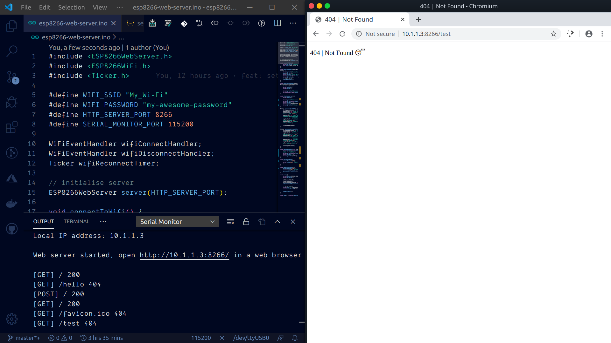

<h1 align="center">🚀 esp8266-web-server</h1>

Run a web server within a NodeMCU ESP8266

<h3 align="center">🙋‍♂️ Made by <a href="https://twitter.com/_abhijithv">@abhijithvijayan</a></h3>

  Donate:
  <a href="https://www.paypal.me/iamabhijithvijayan" target='_blank'><i><b>PayPal</b></i></a>,
  <a href="https://www.patreon.com/abhijithvijayan" target='_blank'><i><b>Patreon</b></i></a>

  

## Station (STA) Mode

The ESP8266 that connects to an existing WiFi network (one created by your wireless router) is called Station (STA)

In STA mode ESP8266 gets IP from wireless router to which it is connected. With this IP address, it can set up a web server and deliver web pages to all connected devices under existing WiFi network.

## Show your support

Give a ⭐️ if this project helped you!

## Licence

Code released under the [MIT License](LICENSE).
